# MSAU-Course-Manangement-System

# Specifications

1. [Login](#Login)
2. [DashBoard](#Dashboard)
3. [Courses](#All-Courses)
4. [Trainings](#Trainings)
5. [Upload Files](#Upload-Files)
6. [Send Mail](#Send-Email)
7. [Students](#Students)

## Login

## Dashboard
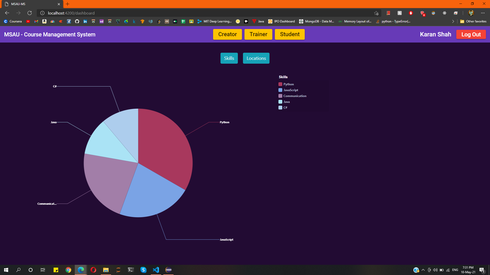
 
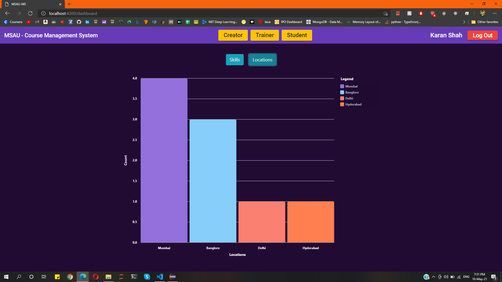

## All Courses
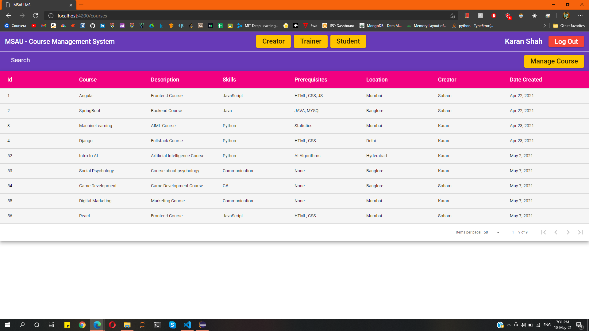

## My Courses
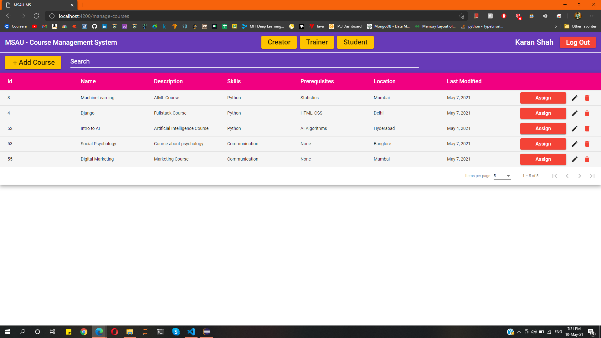

## Add Course
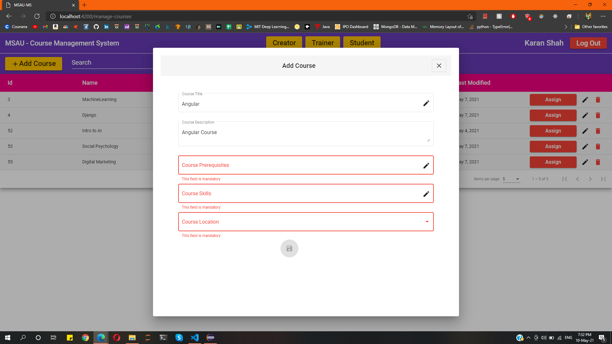

## Edit Course
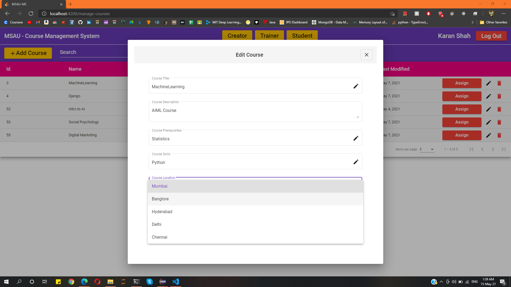

## Assign Trainer
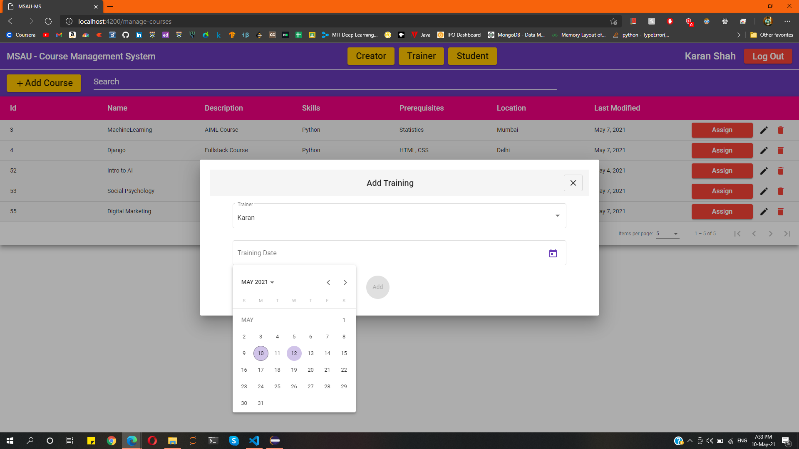

## Trainings
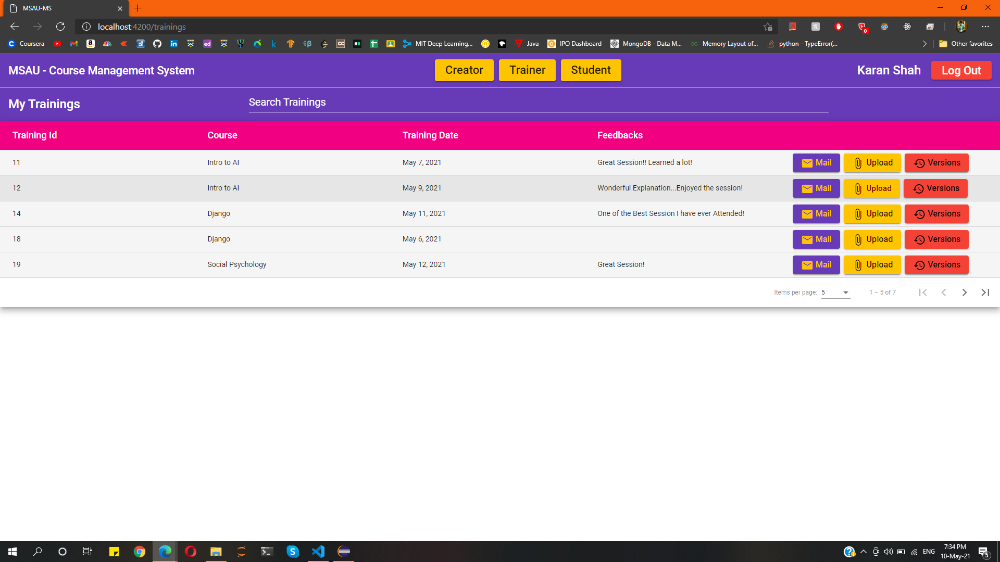

## Upload Files
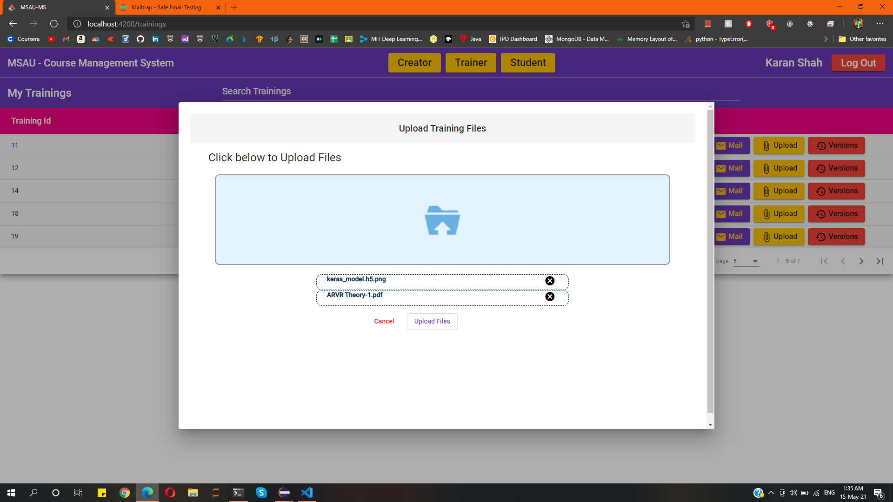

## Get Versions
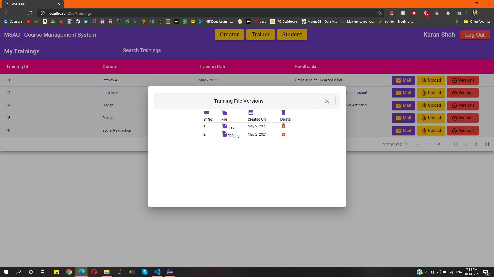

## Send Email
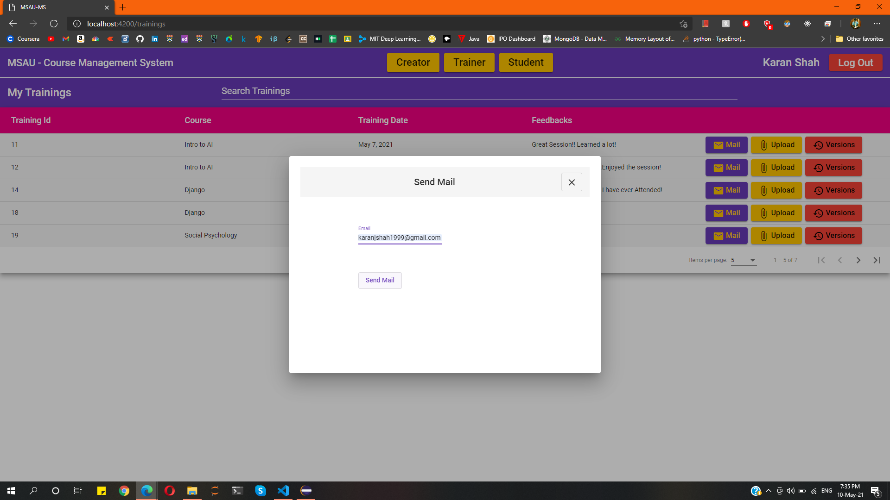
 
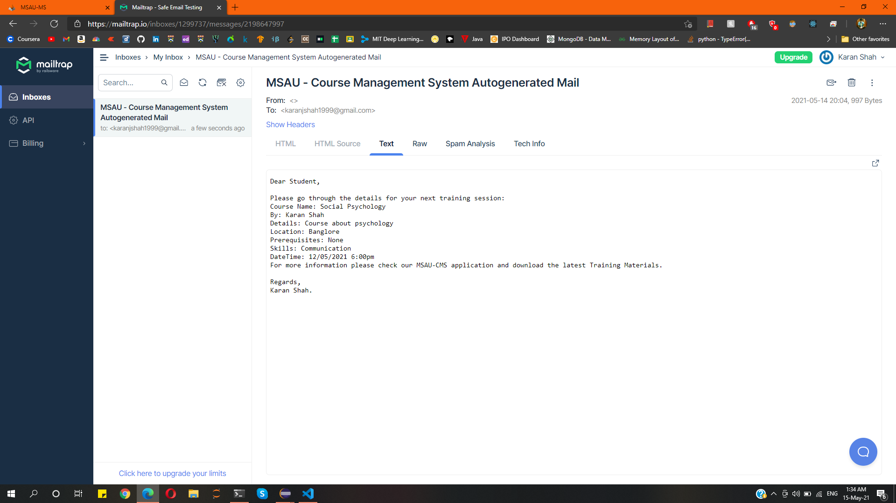

## Students
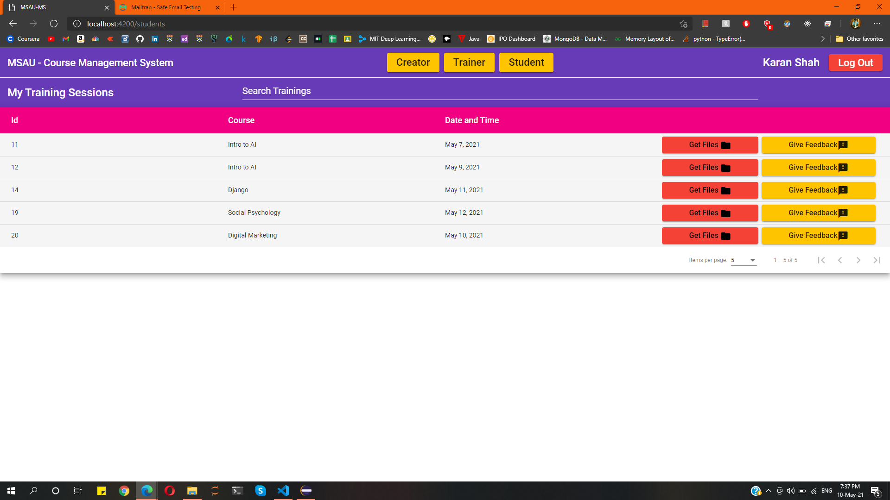

## Get Files
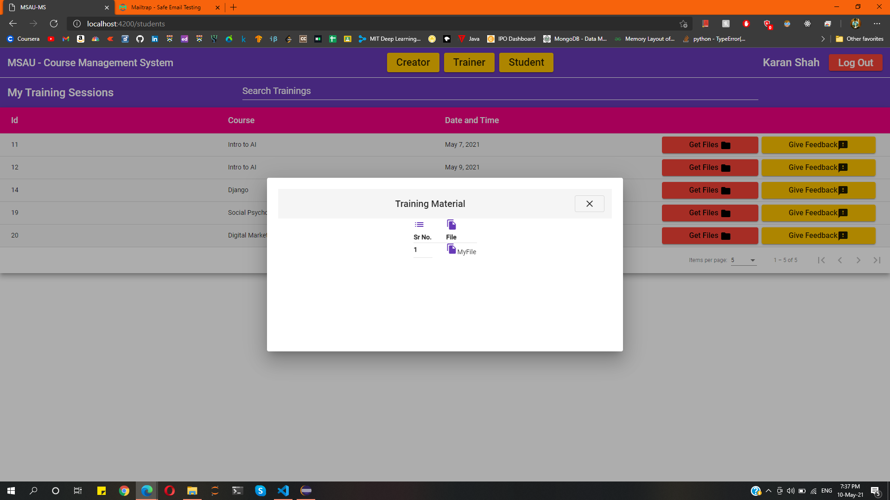

## Give Feedback
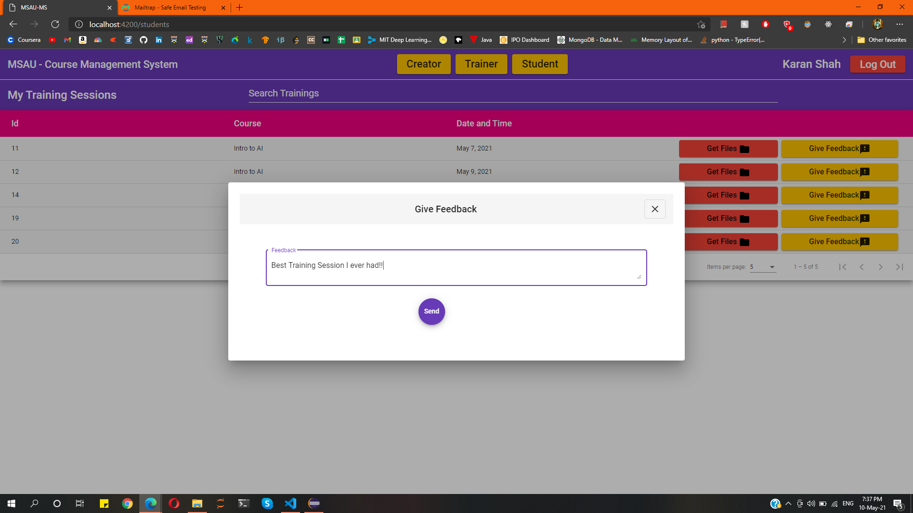

## Page Not Found
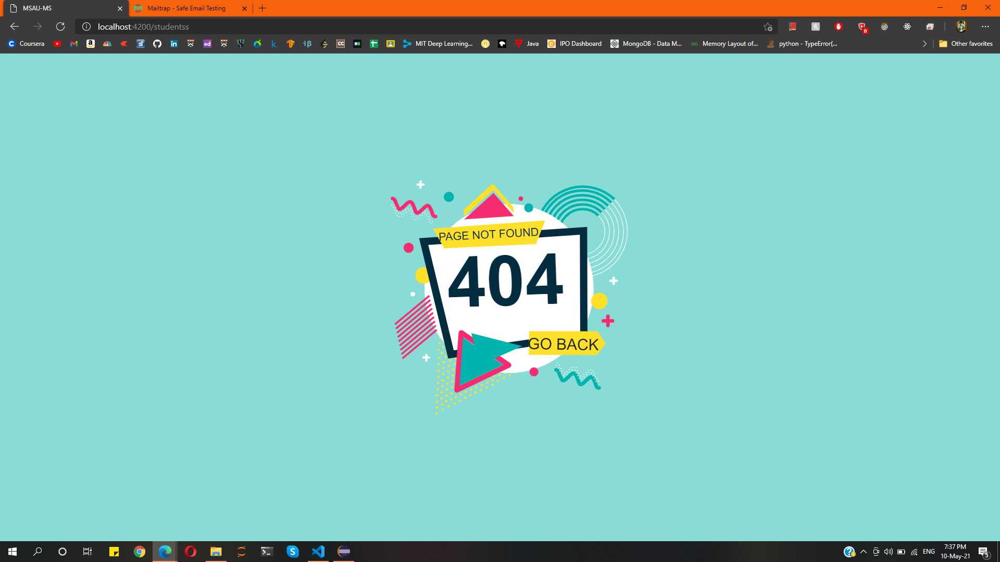
