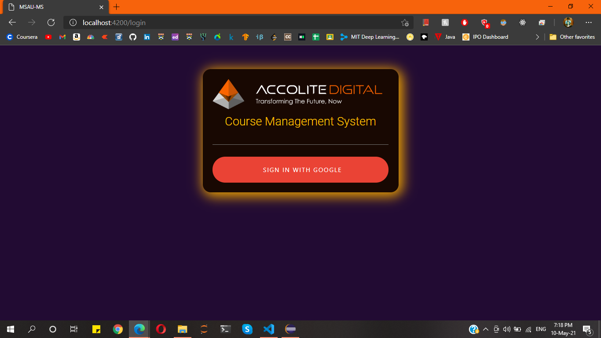

# MSAU-Course-Manangement-System

# Specifications

1. [Login](#Login)
2. [DashBoard](#Dashboard)
3. [Courses](#All-Courses)
4. [Trainings](#Trainings)
5. [Upload Files](#Upload-Files)
6. [Send Mail](#Send-Email)
7. [Students](#Students)

## Login

## Dashboard

 

## All Courses

## My Courses

## Add Course

## Edit Course

## Assign Trainer

## Trainings

## Upload Files

## Get Versions

## Send Email

 

## Students

## Get Files

## Give Feedback

## Page Not Found

